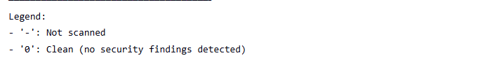
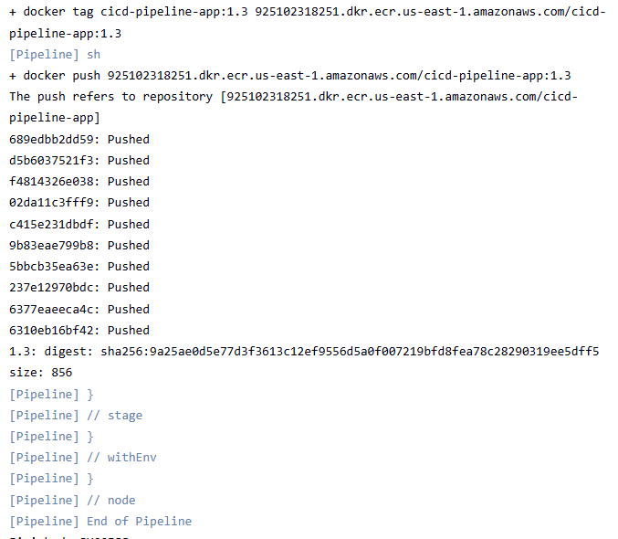
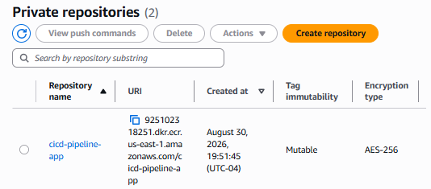
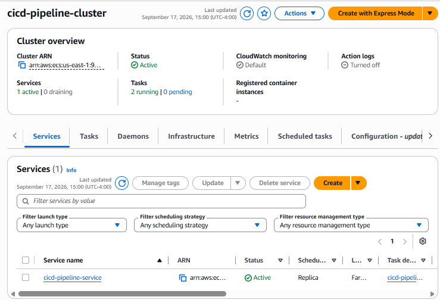
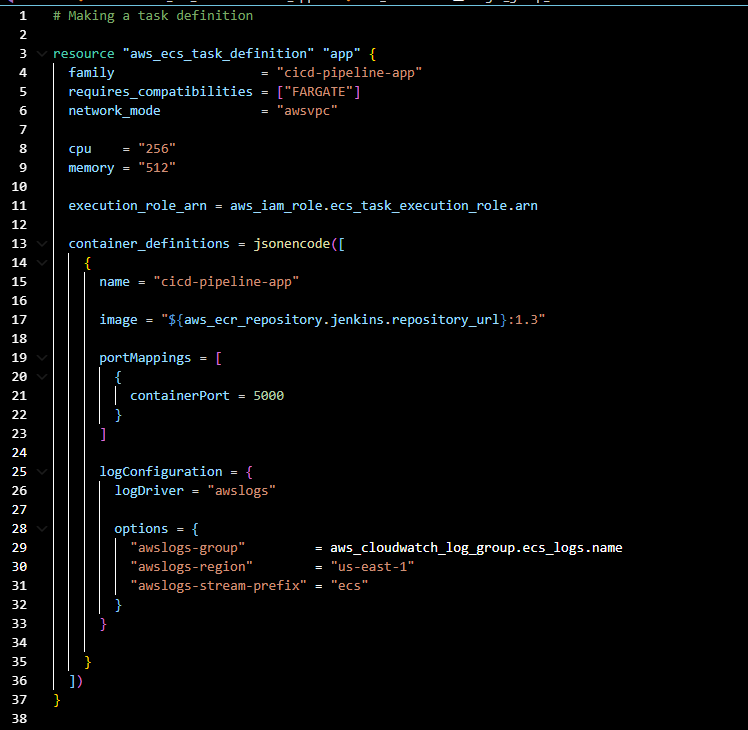
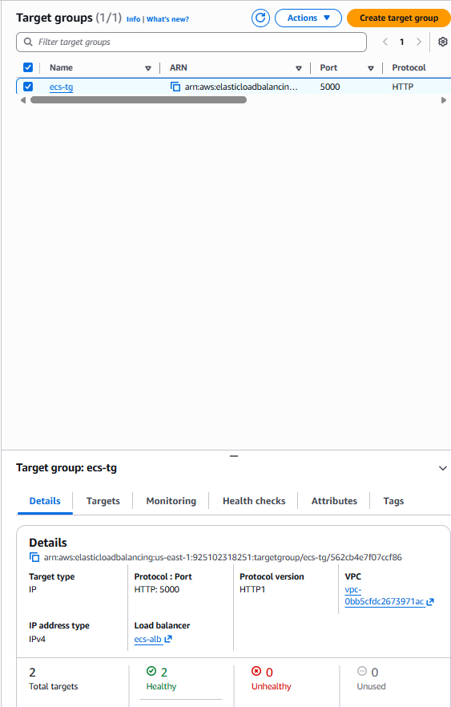
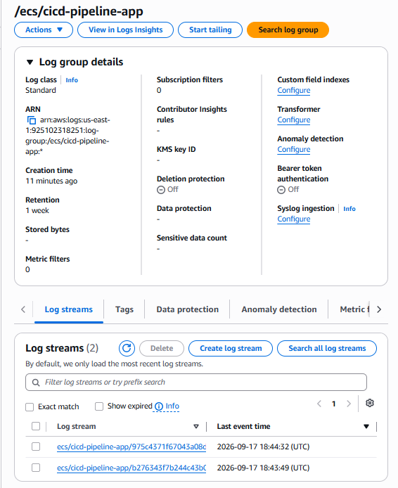
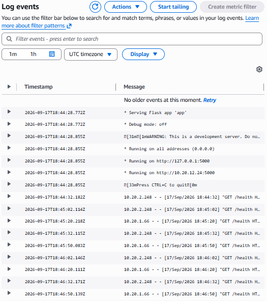
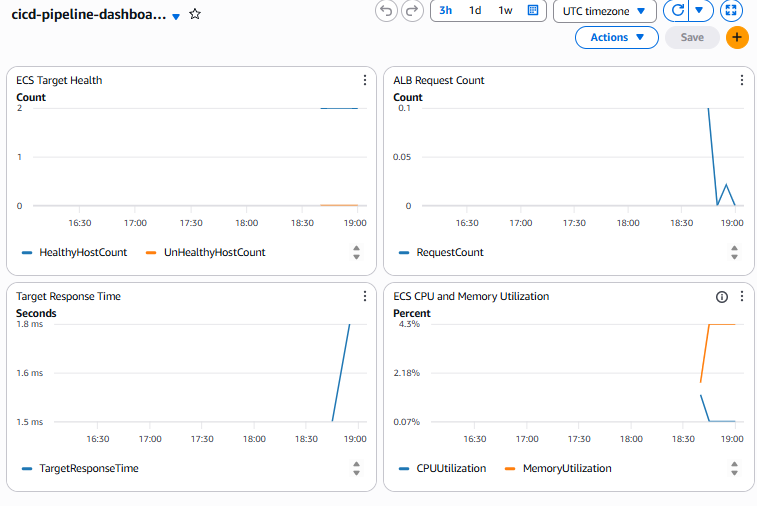
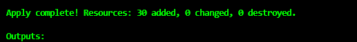

# Secure CI/CD Pipeline to AWS ECS Fargate

A hands-on DevOps/cloud engineering project that builds, tests, scans,
publishes, deploys, and monitors a containerized Flask application on
AWS.

The project combines **Jenkins, Docker, Trivy, Amazon ECR, Terraform,
Amazon ECS/Fargate, an Application Load Balancer, VPC endpoints, IAM,
and Amazon CloudWatch** into one end-to-end delivery workflow.

## Project outcome

The completed deployment demonstrated:

-   A Jenkins CI/CD pipeline that checks out source, installs
    dependencies, checks formatting, runs tests, builds the Docker
    image, authenticates to AWS, scans the image with Trivy, and pushes
    it to Amazon ECR.
-   A dedicated AWS VPC spanning two Availability Zones with public and
    private subnets.
-   Two ECS Fargate tasks running in private subnets with no public IP
    addresses.
-   An internet-facing Application Load Balancer routing HTTP traffic to
    the private ECS tasks on port `5000`.
-   Target-group health checks against `/health`.
-   Private connectivity to ECR, S3, and CloudWatch Logs through VPC
    endpoints rather than a NAT Gateway.
-   Centralized ECS application logs in CloudWatch Logs.
-   A CloudWatch dashboard for target health, request count, target
    response time, CPU utilization, and memory utilization.
-   Infrastructure provisioned and managed with Terraform.

## Architecture

``` text
Developer / GitHub
        |
        v
      Jenkins
        |
        +-- Install Dependencies
        +-- Black Format Check
        +-- Pytest
        +-- Docker Build
        +-- AWS Authentication
        +-- Trivy Security Gate
        |
        v
   Amazon ECR
        |
        | Private AWS connectivity
        |-- ECR API Interface Endpoint
        |-- ECR DKR Interface Endpoint
        |-- S3 Gateway Endpoint
        v
+---------------------------------------------------+
|                    AWS VPC                        |
|                                                   |
| Public Subnet A              Public Subnet B      |
|          \                      /                 |
|           \-- Application Load Balancer --/       |
|                        |                          |
|                 HTTP Listener :80                 |
|                        |                          |
|                 Target Group :5000                |
|                   health: /health                 |
|                        |                          |
|          +-------------+-------------+            |
|          |                           |            |
| Private Subnet A              Private Subnet B    |
| ECS Fargate Task              ECS Fargate Task    |
| No public IP                  No public IP        |
|          |                           |            |
+----------|---------------------------|------------+
           |
           +--> CloudWatch Logs Interface Endpoint
                         |
                         v
                  CloudWatch Logs
                  CloudWatch Dashboard
```

## CI/CD pipeline

The Jenkins pipeline implements the following delivery flow:

``` text
Checkout
  -> Install Dependencies
  -> Format Check
  -> Test
  -> Docker Build
  -> AWS Authentication
  -> Trivy Security Scan
  -> Push to Amazon ECR
```

The Trivy stage is configured as a security gate for `HIGH` and
`CRITICAL` findings. Documented temporary exceptions are tracked
separately in `SECURITY.md` and `.trivyignore`.

### Jenkins pipeline success


### Container security scan



### Docker image pushed to ECR



### Amazon ECR repository



## AWS runtime architecture

The ECS task definition runs the application on **AWS Fargate** using
`awsvpc` networking. Each task receives its own private network
interface and runs without a public IP.

The ECS service maintains **two tasks** across private subnets and
registers them with an ALB target group using IP targets.

### ECS service running two tasks



### ECS task definition

The task definition configures the ECR image, `256` CPU units, `512` MiB
memory, container port `5000`, and the `awslogs` log driver.



## Load balancing and health checks

The public Application Load Balancer accepts HTTP traffic and forwards
requests to the ECS target group on port `5000`.

The target group performs an HTTP health check against:

``` text
/health
```

During verification, both Fargate targets were healthy.



### Internet-facing Application Load Balancer


### End-to-end application test

A browser request through the ALB successfully reached the Flask
application:

``` json
{"message":"CI/CD Pipeline Project Running"}
```


## Private networking

The ECS tasks run in private subnets with `assign_public_ip = false`.

Instead of using a NAT Gateway for AWS service access, the design uses:

  Endpoint          Type        Purpose
  ----------------- ----------- ------------------------------------
  Amazon ECR API    Interface   ECR API/control-plane access
  Amazon ECR DKR    Interface   Docker registry access
  Amazon S3         Gateway     Access to image layers used by ECR
  CloudWatch Logs   Interface   Private delivery of container logs

The public subnets route internet traffic through an Internet Gateway
for the internet-facing ALB. The private route table has no default
internet route.

## Security controls

The design uses security-group separation between the public
load-balancing layer, private application layer, and VPC endpoints.

``` text
Internet
   |
   | HTTP :80
   v
ALB Security Group
   |
   | TCP :5000
   v
ECS Security Group
   |
   | HTTPS :443
   v
Endpoint Security Group
```

The ECS task execution role provides the permissions required for ECS to
pull the image and deliver container logs. Jenkins AWS credentials are
stored through Jenkins Credentials rather than hard-coded into the
pipeline.

## Observability

Application `stdout` and `stderr` are sent through the ECS `awslogs`
driver to:

``` text
/ecs/cicd-pipeline-app
```

The log group uses a seven-day retention period.

### CloudWatch Log Group



### Application and health-check logs

The captured events demonstrate Flask listening on `0.0.0.0:5000` and
ALB health-check requests reaching `/health`.



### CloudWatch dashboard

The Terraform-managed dashboard monitors:

-   `HealthyHostCount` and `UnHealthyHostCount`
-   ALB `RequestCount`
-   `TargetResponseTime`
-   ECS `CPUUtilization`
-   ECS `MemoryUtilization`



## Troubleshooting model

The project was built around evidence-driven troubleshooting rather than
checking services randomly.

``` text
ECS task not RUNNING
-> investigate task startup, image pull, execution role, configuration, and logs

ECS RUNNING + target UNHEALTHY
-> Target Group first
-> health-check path
-> port
-> security groups/network path
-> application listener

Healthy targets + no requests
-> investigate client/DNS/ALB/listener path

Healthy targets + normal traffic + high response time
-> investigate application/task performance and dependencies

High CPU or memory
-> investigate task resource pressure and application behavior

Need the underlying reason
-> inspect CloudWatch Logs
```

## Terraform

Terraform manages the AWS infrastructure, including networking,
endpoints, security groups, IAM, ECR, ECS, ALB resources, CloudWatch
logging, and the dashboard.

Typical workflow:

``` bash
terraform fmt -recursive
terraform validate
terraform plan
terraform apply
```

For a reviewed deployment plan:

``` bash
terraform plan -out=tfplan
terraform apply tfplan
```

Saved plan files and Terraform state are excluded from Git.

### Successful Terraform deployment



## Verification results

The deployed environment was verified end to end:

  -----------------------------------------------------------------------
  Verification                        Result
  ----------------------------------- -----------------------------------
  Terraform deployment                Successful

  ECS desired tasks                   2

  ECS running tasks                   2

  Target group healthy targets        2

  Target group unhealthy targets      0

  ALB application request             Successful

  CloudWatch application logs         Receiving events

  CloudWatch dashboard                Metrics populated

  Private ECR/S3/Logs connectivity    Successful during task
                                      startup/runtime
  -----------------------------------------------------------------------

## Technology stack

**Cloud:** AWS --- VPC, IAM, ECR, ECS/Fargate, Application Load
Balancer, VPC Endpoints, CloudWatch\
**Infrastructure as Code:** Terraform\
**CI/CD:** Jenkins\
**Containers:** Docker\
**Security:** Trivy, security groups, IAM, private subnets\
**Application:** Python / Flask\
**Testing & quality:** Pytest, Black\
**Source control:** Git / GitHub

## Repository structure

``` text
.
├── app/
├── Dockerfile
├── Dockerfile.jenkins
├── Jenkinsfile
├── SECURITY.md
├── .trivyignore
├── ecr.tf
├── ecs.tf
├── load_balancer.tf
├── monitoring.tf
├── network.tf
├── outputs.tf
├── provider.tf
├── roles.tf
├── security.tf
└── variables.tf
```

## Key lessons demonstrated

This project demonstrates more than provisioning AWS resources. It
connects the full software-delivery lifecycle: source control, automated
quality checks, containerization, vulnerability scanning, registry
publishing, infrastructure as code, private container networking, load
balancing, health checks, IAM, centralized logging, metrics, and
operational troubleshooting.

The deployed infrastructure was intentionally destroyed after validation
to avoid unnecessary cloud charges; the Terraform configuration can
reproduce the environment.
